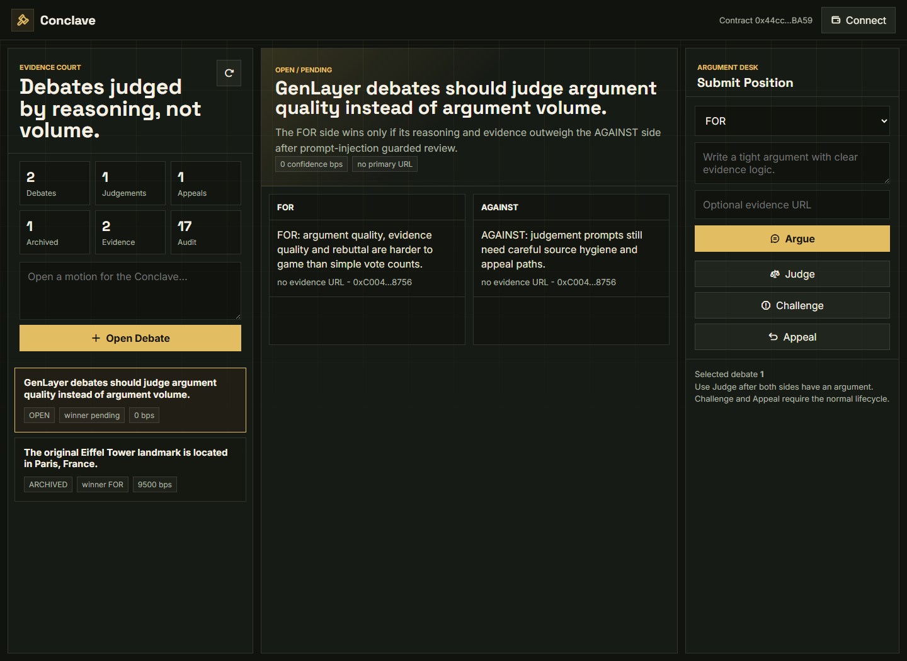
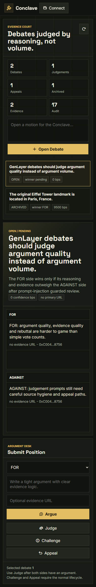

# Conclave

Conclave is a GenLayer evidence-weighted debate court. It is built for motions where two sides need more than a comment thread: structured FOR and AGAINST positions, public evidence, validator review, challenge windows, appeals, final outcomes, reputation and a permanent audit trail.

The product shape is intentionally different from a dashboard or escrow app. Conclave feels like a deliberation chamber: open a motion, build the argument record, let GenLayer read the sources, then preserve the reasoning path that produced the ruling.



## Live Deployment

| Item | Value |
| --- | --- |
| Network | GenLayer Studionet |
| Chain ID | `61999` |
| Contract | `0x44ccfCdeb1e9667C8548E051eDcf6D734c3fBA59` |
| Contract Explorer | https://explorer-studio.genlayer.com/address/0x44ccfCdeb1e9667C8548E051eDcf6D734c3fBA59 |
| Deploy TX | `0xbb0fae532cd8410e970abe6a3c97416ab7dbe0e506bd99812b9cf97be68b06b0` |
| Deployed | `2026-06-23T20:12:44.928Z` |

## What It Does

Conclave turns an argument into an auditable on-chain process:

- Open a motion with a resolution rule.
- Add FOR and AGAINST positions.
- Attach evidence URLs to the debate record.
- Trigger GenLayer validator reasoning over public sources.
- Open a challenge window after judgement.
- Submit challenge and appeal filings with their own evidence.
- Resolve challenges and appeals with a second source-aware review.
- Finalize or archive the debate.
- Track contributor reputation from debate, evidence, challenge and appeal outcomes.



## Contract Surface

`contracts/conclave_v2.py` is the deployed GenLayer contract source.

Primary write methods:

| Method | Purpose |
| --- | --- |
| `set_conclave_standard` | Sets the court's review standard. |
| `open_staked_debate` | Opens a payable debate with stake value. |
| `draft_debate` | Opens an automation-safe debate without value transfer. |
| `open_debate` | Legacy-compatible simple debate entry point used by the UI. |
| `add_position` / `argue` | Adds structured FOR or AGAINST positions. |
| `add_evidence` | Adds public evidence URLs. |
| `open_deliberation` | Moves a debate into deliberation. |
| `judge_debate_with_genlayer` / `conclude` | Runs source-aware validator judgement. |
| `open_challenge_window` | Allows post-judgement disputes. |
| `submit_challenge` / `resolve_challenge_with_genlayer` | Files and resolves a challenge. |
| `submit_appeal` / `resolve_appeal_with_genlayer` | Escalates and resolves an appeal. |
| `settle` | Finalizes the winning side. |
| `archive_debate` | Closes the public record after finalization. |
| `recalculate_reputation` | Refreshes contributor scoring. |

Core read methods expose debate records, positions, evidence, judgements, challenges, appeals, audit logs, public summaries, reputation profiles, top contributors, frontend bootstrap data, stats and quality scoring.

## GenLayer Reasoning

Conclave V2 uses GenLayer nondeterminism where it matters:

- `gl.nondet.web.render` reads public source pages attached to the debate.
- `gl.nondet.exec_prompt` asks for a strict JSON ruling.
- `gl.eq_principle.prompt_comparative` reconciles validator outputs.

The prompts treat cited pages as evidence only, not as instructions. Rulings are normalized into bounded fields such as `outcome`, `confidenceBps`, `winnerBps`, `summary`, `rationale` and `riskFlags`.

## Smoke Trail

The deployed Studionet smoke run finalized a complete debate lifecycle:

| Step | Transaction |
| --- | --- |
| `set_conclave_standard` | `0xef60d263dd657cdf7ada923c10e5af714e9ad32a9eb7cef785da565d76d0f512` |
| `draft_debate` | `0x9dd574e454f12439071a3e3a3da96537883a2a515e75ef3920b54d38f1029bfc` |
| `add_position_for` | `0xd00676a9ec9b418499828e96cb294294403f30f43d42bfa73685e62e431f1e94` |
| `add_position_against` | `0xdb1edea4b5505efa34ee8f448cbdb41390283cd6299f9830f8a410e578ad2adb` |
| `add_evidence` wiki | `0xc2d6109d9b71018e5ce45e75f21f9f69ef833c6cd2e0513aa86a2439f8269edb` |
| `add_evidence` encyclopedia | `0x46411a6120f058de4227869cc2d7a008aba589e4e2a069dac73a140bfa8742e6` |
| `open_deliberation` | `0x00872d590f1098f18213c1c081d32643ee1aae3c90e5c192fcd1dff8089473c1` |
| `judge_debate_with_genlayer` | `0x8f08ad567fb89d26c3f5076d5a24869801afd86addee458d38dab51e62652d73` |
| `open_challenge_window` | `0x2e4078e23a9b5ec021c4643d111f9f68ac6b9a307262582e740eef26488255ee` |
| `submit_challenge` | `0xe7d69d1cda59fca94c62b21208cb6ee26f71dffd16824405c5e6717510f752f1` |
| `resolve_challenge_with_genlayer` | `0xffcb707d993c8550fde19a99de41a8ef8e0c1a548483ac56205d5880d1160966` |
| `submit_appeal` | `0xab8b50833cec50f37c1301cccf4c2f51ac349c2acf2b51dcd38c602380eed5f4` |
| `resolve_appeal_with_genlayer` | `0x995b2fddb6a44499b9dda977ebde7ce93b06fdfe59c210d487957b22d3dbcffa` |
| `settle` | `0xbed31a82b8ea82965961d7554522881c23ee4f1e5ebd9c65a8d4eee4427bcebb` |
| `archive_debate` | `0x9c5cc7dd6428d50c309659763490684b77f223ca8e546f79fde62b20e95db9d5` |
| `recalculate_reputation` | `0x935f5e69f5d485e9dd72cf495485e1c65f3a62eb816e5e38b732fac7bea659f1` |

## Repository Layout

```text
public/index.html              Debate court shell served by Vercel
public/styles.css              Dark deliberation UI with three-column workspace
public/app.js                  Studionet reads/writes and wallet actions
public/shared/genlayer-lite.js Browser-only GenLayer helper
contracts/conclave_v2.py       Deployed GenLayer contract source for review
deployment.json                Public deployment and smoke metadata
vercel.json                    Production security headers
```

## Local Development

```powershell
npm install
npm run dev
```

Open:

```text
http://localhost:4804
```

The app uses browser ES modules and CDN imports, so serve `public/` over localhost instead of opening the HTML file directly.

## Production Deploy

Conclave is deployed as a static Vercel project.

Recommended Vercel settings:

| Setting | Value |
| --- | --- |
| Framework Preset | Other |
| Build Command | None |
| Output Directory | `public` |
| Environment Variables | None required |

## Security Notes

- No private keys, seed phrases, vault files, or wallet exports belong in this repo.
- The included addresses and transaction hashes are public Studionet metadata.
- Writes require a connected injected wallet and explicit confirmation.
- Production headers are defined in `vercel.json`.
- External evidence and explorer links use `rel="noopener"`.

Run the local safety check before pushing:

```powershell
npm run security:scan
```
